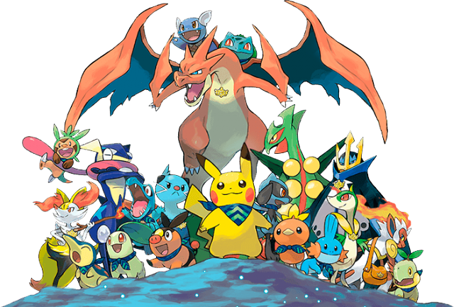
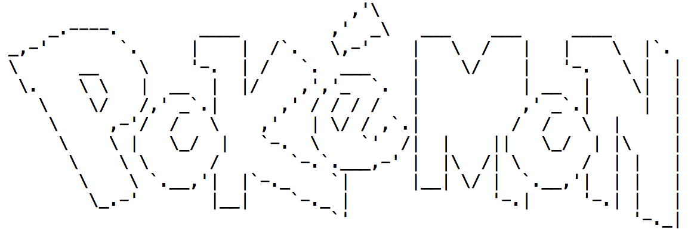

<style>
div.challenge { 
  background-color: #e6f2ff;
  padding: 1em;
  padding-bottom: 0.3em;
  border-radius: 25px;
  border: 2px solid #317EAC;
}

div.challenge pre { 
  margin-right: 40px;
}
</style>


```{r global_options, include=FALSE}
knitr::opts_chunk$set(eval = FALSE)
library(reticulate)
use_python("/Library/Frameworks/Python.framework/Versions/3.6/bin/python3")
py_config()
```

In this assignment, you'll practice working with **classes and object-oriented programming techniques** by building a simiplified Pokémon-like game. You'll have lots of freedom to determine the game mechanics. Because most of us are new to Object-Oriented Programming, this assignment is structures a little more like a lab to help you get started.

###   Challenge 1: Creating a class definition

Recall from lecture that `classes` function as **blueprints** for building **objects** in Python. They bundle together data (inside `attributes`) and actions (inside `methods`) in ways that are both logical and easy to maintain/extend. In this first challenge, we'll create a generic `Pokemon` class.

<div style="text-align:center"></div>
<div class = "challenge">
Create a `Pokemon` class. The class definition should include:

 * a **constructor** that takes in a `name` parameter
 * the constructor should initialize the following `attributes` (don't forget that all `attributes/methods` should be members of the `Pokemon` class -- use the word `self`!):
    * `name` = the value contained in the `name` parameter passed to the **constructor**
    * `pokemon_type` = `"NORMAL"`
    * `max_hp` = a random integer (you decide the range)
    * `current_hp` =  `max_hp`
    * `attack_power`  = a random integer (greater than 0 but less than `hp`)
    * `defensive_power` = a random integer (greater than 0 but less than `hp`)
    * `fainted` = `False`
 * a method called `printStats()` that prints the Pokémon's stats to the screen
 * a method called `defend()` that decreases the value of `current_hp` by some amount (you determine by how much, but it should probably be related to `defense` in some way) and setting `fainted = True` if `current_hp` falls below 0
  * a method called `attack(opponent)` that takes in an opponent (another `Pokemon` instance) and decreases its `current_hp` by calling `opponent.defend()`
 * a method called `revive()` that if `fainted = True` sets `current_hp = max_hp/2` and `fainted = False` and returns `True`, otherwise returns `False`
 
Test out your class by creating an `instance` of the `Pokemon` class in your `main()` function, calling `.printStats()` once to see the starting stats, calling `.defend()` until the Pokemon faints, and then calling `.revive()` and `.printStats()` again.

</div>

###   Challenge 2: Creating a simple `battle()` function
Woohoo, you've got your Pokémon `class` working! Unfortunately, the game isn't very much fun by yourself.

<div class = "challenge">
Create a `battle()` **function** that takes two `Pokemon` instances (one belonging to each player), and alternates between them. 

On each player's turn, their `Pokemon` will attack the other player's Pokemon, and the defending Pokemon will then print its stats. You may want to print additional information to the screen to make gameplay more interesting.

Test your `battle()` function by creating a second `Pokemon` instance within your `main()` function, and calling `battle()` on the two instances.
</div>

###   Challenge 3: Extending the class definition
In the actual game, there is more than one kind of Pokémon, each with its own special kinds of attack.
<div class = "challenge">
Add three or more subclasses that **extend** the `Pokemon` class, modifying the `pokemon_type` if necessary and overriding the `attack()` method (which may do different kinds of damage depending on the opponent). For example:

```
class Pikachu(Pokemon):

  self.type = "ELECTRIC"
  
  def attack(opponent):
      if (opponent.type == "GROUND"):
        # super-effective
        # do twice as much damage
      elif (opponent.type == "ELECTRIC" or opponent.type = "FLYING"):
        # not effective
        # do half as much damage
    
```
Test out your subclasses by creating instances of them in your `main()` function, and then calling `battle()` repeatedly to see how they fare against one another.
</div>

###   Final Challenge: Coder's Choice!
<div class = "challenge">
Add some additional functionality to make the game more interesting: you might implement a more complex formula for `.attack()/.defend()`, add multiple kinds of `.attack()` and allow the player to choose between them, use ASCII art to make the game more visually appealing... how far you go is entirely up to you!

_Recommendation: if you find yourself adding the same functionality to every subclass (e.g. if you want your Pokémon to have a `nickname`, etc.), consider changing the **parent `class`** instead!_
</div>

<br/>


###  Submission of Assignment 7

* Use this link to submit your `pokemon.py` file via [Moodle](https://moodle.smith.edu/mod/assign/view.php?id=379561).